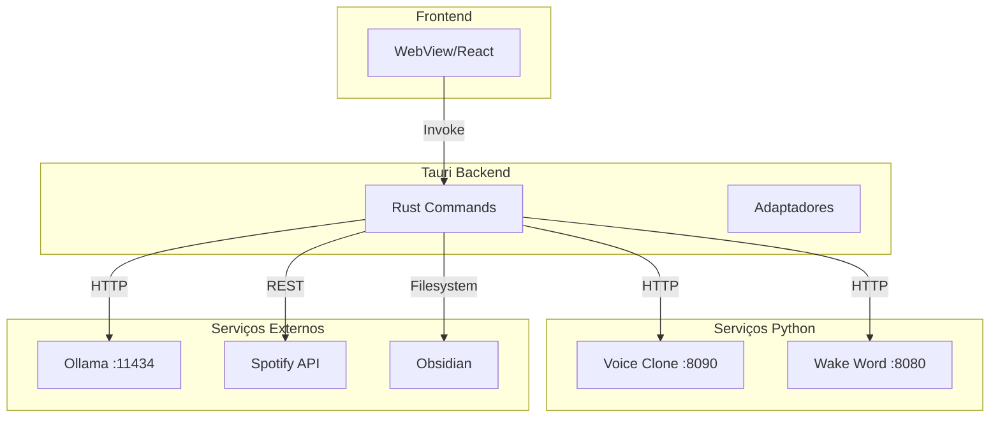
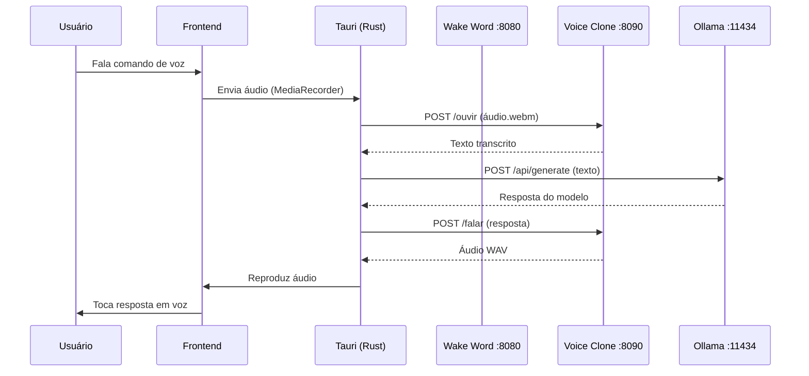
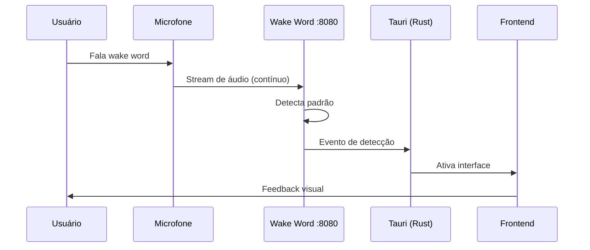
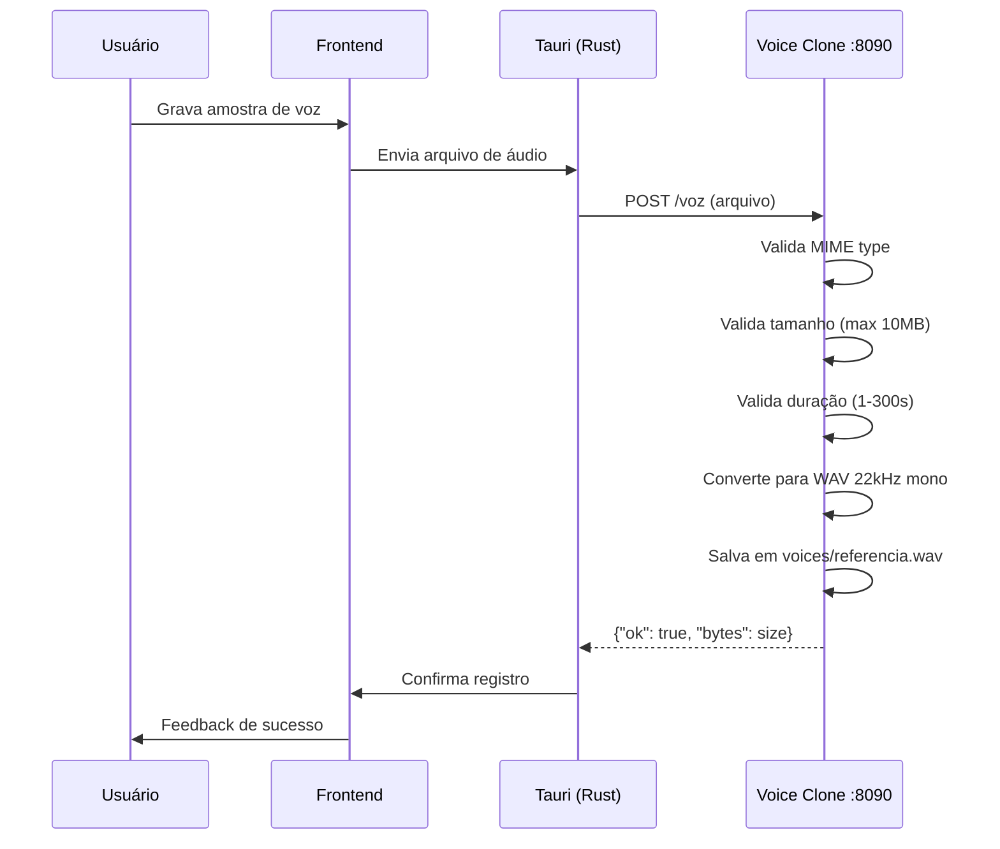
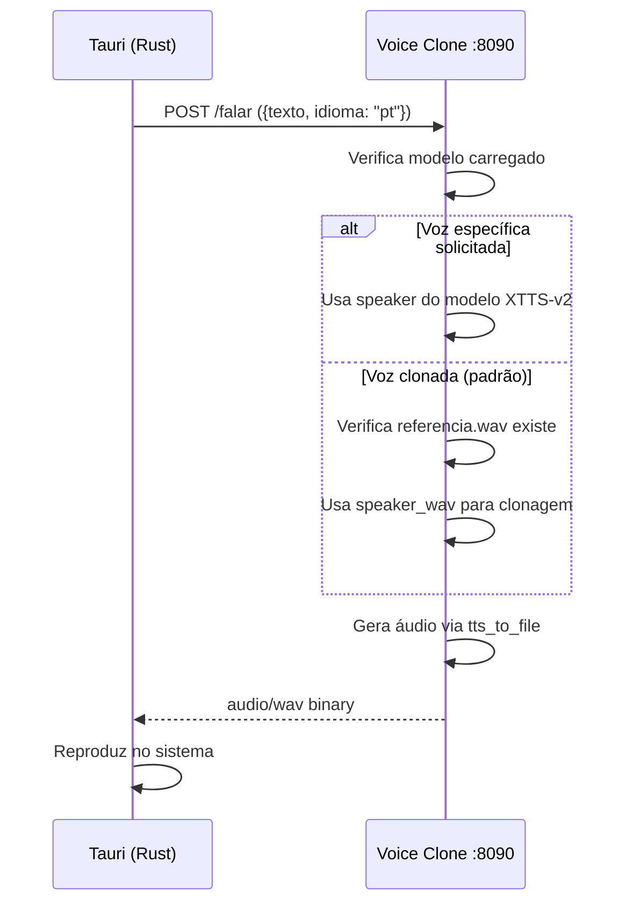

# Ports e Fluxos de Comunicação - JARVIS AI OS

**Última Atualização:** 31 de Agosto de 2025  
**Responsável:** Assistente de IA (GPT-4)

---

## Visão Geral da Arquitetura



---

## Portas Utilizadas

### Serviços Locais

| Serviço | Porta | Protocolo | Descrição |
|---------|-------|-----------|-----------|
| **Voice Clone Service** | 8090 | HTTP | Síntese e reconhecimento de voz (XTTS-v2 + Whisper) |
| **Wake Word Service** | 8080 | HTTP | Detecção de palavra de ativação |
| **Ollama** | 11434 | HTTP | Modelos de linguagem local |
| **Dev Frontend** | 1420 | HTTP | Vite dev server |
| **Production WebView** | - | tauri:// | Schema do Tauri em produção |

### Endpoints por Serviço

#### Voice Clone Service (Porta 8090)

| Endpoint | Método | Descrição | Payload | Resposta |
|----------|--------|-----------|---------|----------|
| `/health` | GET | Status básico do serviço | - | `{"ok": bool, "modelo_carregado": bool}` |
| `/health/detailed` | GET | Status detalhado com recursos | - | `{ok, modelo_tts, modelo_stt, recursos, voz_referencia}` |
| `/vozes` | GET | Lista vozes disponíveis | - | `{"vozes": {nome: descrição}}` |
| `/voz` | POST | Registra amostra de voz | `file: audio/*` | `{"ok": bool, "bytes": int}` |
| `/falar` | POST | Sintetiza texto em áudio | `{texto, idioma?, voz?, velocidade?}` | `audio/wav` |
| `/ouvir` | POST | Transcreve áudio para texto | `file: audio/*, idioma: form` | `{"texto": string}` |

#### Wake Word Service (Porta 8080)

| Endpoint | Método | Descrição | Payload | Resposta |
|----------|--------|-----------|---------|----------|
| `/health` | GET | Status do serviço | - | `{"ok": bool, "modelo_carregado": bool}` |
| `/detect` | POST | Processa áudio para detecção | `file: audio/*` | `{"detected": bool, "keyword": string}` |

---

## Fluxos de Comunicação

### 1. Comando de Voz → Ação



### 2. Detecção de Wake Word



### 3. Registro de Voz Clonada



### 4. Síntese de Voz com Clonagem



---

## Protocolos de Segurança

### CORS (Cross-Origin Resource Sharing)

**Voice Clone Service:**
```python
allow_origin_regex=r"^(http://localhost:1420|https?://tauri\.localhost|tauri://localhost)$"
```

**Origens Permitidas:**
- `http://localhost:1420` - Desenvolvimento frontend
- `https://tauri.localhost` - Produção (HTTPS)
- `tauri://localhost` - Produção (schema Tauri)

### Validação de Arquivos

**Tipos MIME Suportados:**
```python
ALLOWED_AUDIO_MIME_TYPES = {
    "audio/wav": ".wav",
    "audio/wave": ".wav",
    "audio/x-wav": ".wav",
    "audio/webm": ".webm",
    "audio/ogg": ".ogg",
    "audio/mp4": ".mp4",
    "audio/mpeg": ".mp3",
}
```

**Limites:**
- Tamanho máximo: 10 MB
- Duração mínima: 1 segundo
- Duração máxima: 300 segundos (5 minutos)

### Health Checks

**Endpoint Básico (`GET /health`):**
```json
{
  "ok": true,
  "modelo_carregado": true,
  "voz_configurada": true,
  "reconhecimento_carregado": false,
  "reconhecimento_a_carregar": false
}
```

**Endpoint Detalhado (`GET /health/detailed`):**
```json
{
  "ok": true,
  "timestamp": "2025-08-31T12:00:00Z",
  "modelo_tts": {
    "carregado": true,
    "device": "cuda"
  },
  "modelo_stt": {
    "carregado": false,
    "carregando": false,
    "model_name": "small"
  },
  "recursos": {
    "memoria_rss_mb": 1024.5,
    "memoria_vms_mb": 2048.3,
    "cpu_percent": 12.5
  },
  "voz_referencia": {
    "existe": true,
    "tamanho_bytes": 524288
  }
}
```

---

## Integração com Serviços Externos

### Ollama (LLM Local)

**Base URL:** `http://localhost:11434`

**Endpoints Usados:**
- `POST /api/generate` - Geração de texto
- `POST /api/chat` - Chat com histórico
- `GET /api/tags` - Lista modelos disponíveis

**Exemplo de Request:**
```bash
curl http://localhost:11434/api/generate -d '{
  "model": "llama3.1:8b",
  "prompt": "Olá, como estás?",
  "stream": false
}'
```

### Spotify API

**Autenticação:** OAuth 2.0 (PKCE)

**Endpoints:**
- `GET /v1/me/player` - Status do player
- `PUT /v1/me/player/play` - Iniciar reprodução
- `PUT /v1/me/player/pause` - Pausar reprodução
- `GET /v1/me/player/currently-playing` - Música atual

### Obsidian Vault

**Acesso:** Filesystem local

**Operações:**
- Leitura de notas (Markdown)
- Escrita de novas notas
- Busca em conteúdo
- Links entre notas

---

## Monitoramento e Logs

### Métricas Coletadas

**Por Serviço Python:**
- Uso de memória (RSS/VMS)
- Uso de CPU (%)
- Tempo de carregamento de modelos
- Requests por minuto
- Taxa de erro

**Coleta Sugerida:**
```bash
# Prometheus metrics endpoint (futuro)
curl http://localhost:8090/metrics
```

### Logs Estruturados

**Formato Sugerido:**
```json
{
  "timestamp": "2025-08-31T12:00:00Z",
  "level": "INFO",
  "service": "voice-clone",
  "endpoint": "/falar",
  "method": "POST",
  "status": 200,
  "duration_ms": 1250,
  "request_id": "abc123"
}
```

---

## Troubleshooting

### Problemas Comuns

#### 1. CORS Error no Browser
**Sintoma:** `Access to fetch at 'http://localhost:8090' has been blocked by CORS policy`

**Solução:** Verificar se a porta do frontend corresponde ao regex CORS configurado.

#### 2. Modelo Não Carrega
**Sintoma:** `/health` retorna `modelo_carregado: false`

**Diagnóstico:**
```bash
curl http://localhost:8090/health/detailed | jq
```

**Causas Possíveis:**
- GPU sem memória suficiente
- CUDA version incompatível
- Modelo corrompido

#### 3. Áudio Não Transcreve
**Sintoma:** `/ouvir` retorna texto vazio

**Verificações:**
- Formato do arquivo é suportado?
- Duração > 1 segundo?
- Whisper model carregado?
- Áudio contém ruído apenas?

---

## Referências

- [ARCHITECTURE.md](../ARCHITECTURE.md) - Arquitetura geral
- [SPEC.md](../SPEC.md) - Especificação completa
- [docs/spec/voz-clonada-local.md](spec/voz-clonada-local.md) - Parte 7.1
- [docs/spec/wake-word-local.md](spec/wake-word-local.md) - Wake word local

---

**Documento criado por:** Assistente de IA (GPT-4)  
**Data:** 31 de Agosto de 2025  
**Hash:** JARVIS-PORTS-FLOWS-2025-08-31-AI
